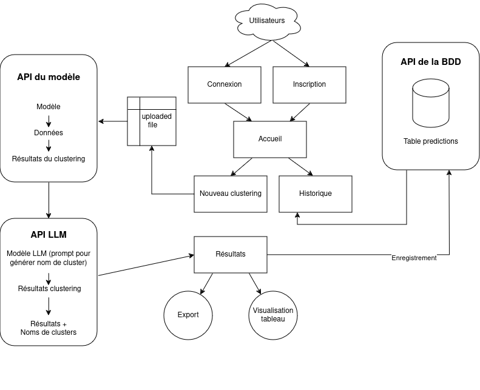

# Application functionalities 

A web app Django is developed to use the clustering model to create problems (groups of similar incidents). Users can upload a file with incidents data and the web app return a table and a file with the clustered data. A dashboard of the predictions is also available. 

