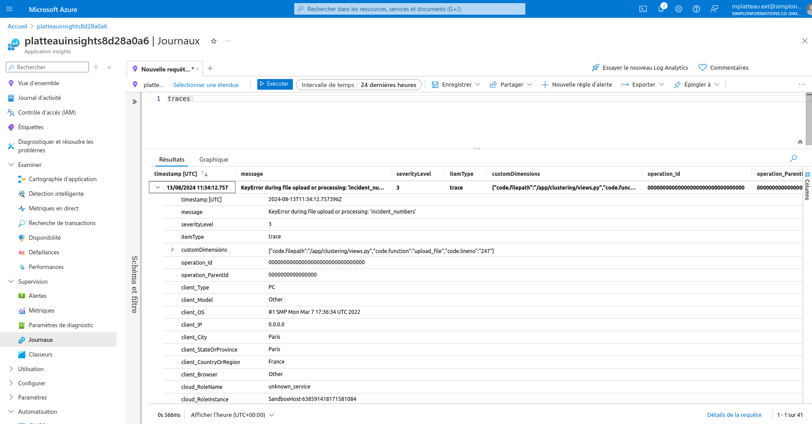
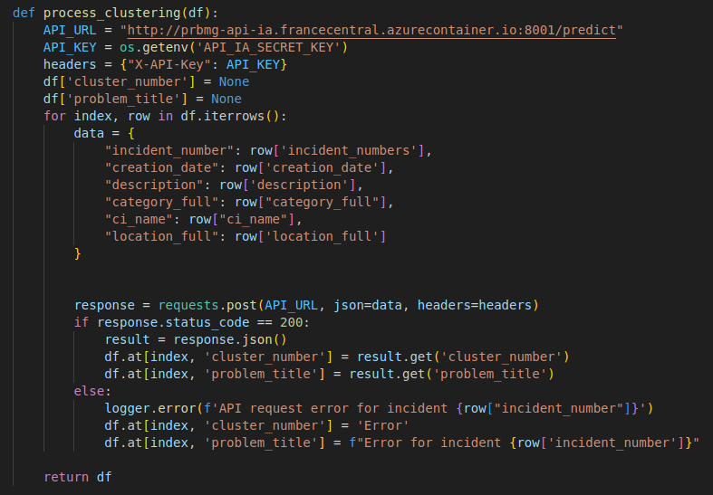
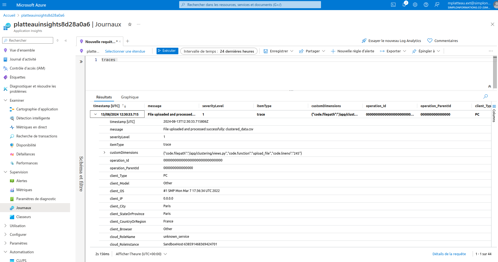

# Incident resolution 

## Incident detection 

### An incident occured on the web application : 

### Logs revealed a key error, it seems that there is an error in the column name "incident_number" : 

## Resolution 
### The error was identified in the code and corrected. The solution is versioned and code is update with the CD pipeline execution : 

### Logs are now reporting successfully, indicating that error has been resolved : 

