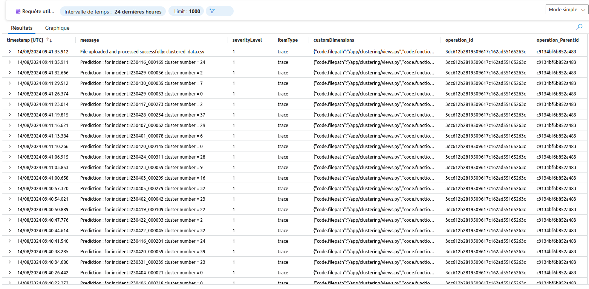
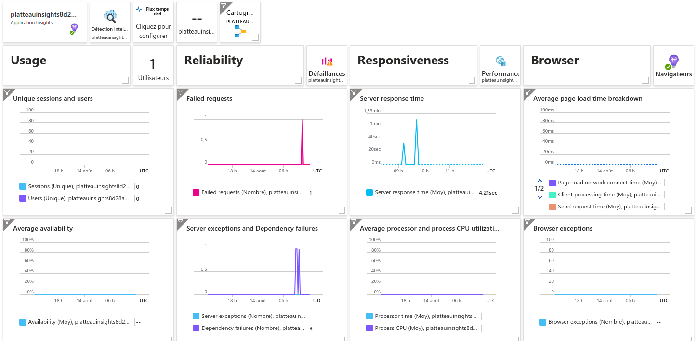
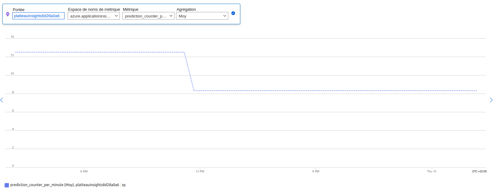

# Web app monitoring

The monitoring of the Django web application is achieved through **Azure Monitor** and **OpenTelemetry**.

## Configuration

An <code>opentelemetry_setup.py</code> file is created in the same directory as the <code>settings.py</code> file of the Django application. This file connects the application to Azure Monitor via the Application Insights URL. It also configures the logs, traces, and metrics to be monitored.

```python 
APPLICATIONINSIGHTS_CONNECTION_STRING=os.getenv('APPLICATIONINSIGHTS_CONNECTION_STRING')
if not APPLICATIONINSIGHTS_CONNECTION_STRING:
    raise ValueError("The APPLICATIONINSIGHTS_CONNECTION_STRING environment variable is not set or is empty.")

# SET UP LOGGING EXPORTER
logger_provider = LoggerProvider()
set_logger_provider(logger_provider)

exporter = AzureMonitorLogExporter(
    connection_string=APPLICATIONINSIGHTS_CONNECTION_STRING
)
logger_provider.add_log_record_processor(BatchLogRecordProcessor(exporter))

# Attach LoggingHandler to namespaced logger
handler = LoggingHandler()
logger = logging.getLogger(__name__)
logger.addHandler(handler)
logger.setLevel(logging.INFO)


DjangoInstrumentor().instrument()

RequestsInstrumentor().instrument()

# SET UP TRACE EXPORTER
trace_exporter = AzureMonitorTraceExporter(
    connection_string=APPLICATIONINSIGHTS_CONNECTION_STRING
)
resource = Resource(attributes={"cloud.role": "DjangoApplication","service.name":"DjangoApplication"})
tracer_provider = TracerProvider(resource=resource)
tracer_provider.add_span_processor(BatchSpanProcessor(trace_exporter))

trace.set_tracer_provider(tracer_provider)
tracer = trace.get_tracer(__name__)


metric_exporter = AzureMonitorMetricExporter(
    connection_string=APPLICATIONINSIGHTS_CONNECTION_STRING
)

frequency_millis = 60000 #min
reader = PeriodicExportingMetricReader(exporter=metric_exporter, export_interval_millis=frequency_millis)
metrics.set_meter_provider(MeterProvider(metric_readers=[reader]))
meter = metrics.get_meter_provider().get_meter("satisfaction_metrics")

# Create custom metric 
prediction_counter_per_minute = meter.create_counter("prediction_counter_per_minute")
```

## Logs

Logs are available in Application Insights on Azure, providing detailed information about application activities and issues.



## Metrics

Azure Monitor, through automatic instrumentation, offers a range of metrics about the application, including request rate, response duration, and response status codes. It also provides performance metrics such as CPU usage and memory consumption. Additionally, log metrics such as log counts and severity levels are available. We have implemented a custom metric, prediction_per_minute, to track specific performance indicators relevant to our application.






## Alerts

Azure Monitor includes an alerting system that can be configured to notify administrators of significant events. We have set up an alerting rule to send an email to the administrator if the number of failed requests reaches 10.

